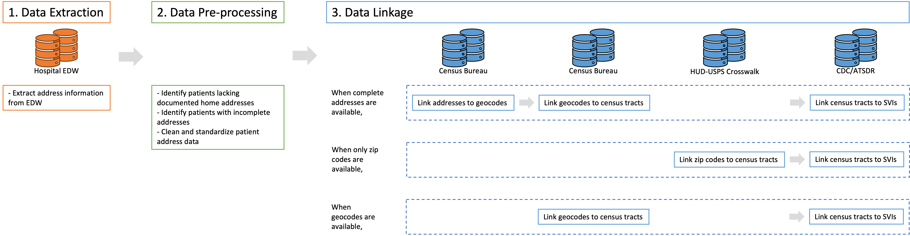
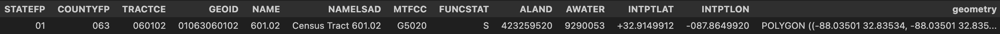

<p align="center"> ## Geomapping Pipeline </p>
<p align="center">  </p>
<!--asldfkj-->

<!---->
<!--[](https://pypi.org/pypi/shap/)-->

**SDOH (Social Determinants of Health)** 

The Social Determinants of Health (SDOH) Code Repository was initially created for the research paper 'Social Determinants of Health and Limitation of Life-Sustaining Therapy in Neurocritical Care: A CHoRUS Pilot Project' but serves as a central hub for sharing, refining, and reusing code utilized in SDOH projects, including but not limited to CHoRUS projects (see [papers](#citations) for details and citations).

Neighborhood-level SDOH (NL-SDOH) involve factors that characterize a patient's residential area, such as proximity to the hospital. The Social Vulnerability Index (SVI) is one of a neighborhood-level measure quantifying healthcare disparities risk across various subdomains based on the patient's neighborhood. NL-SDOH data in this repository were obtained from the Center for Disease Control and Prevention Agency for Toxic Substances and Disease Registry (CDC/ATSDR) of the U.S. Census Bureau. Later, other databases will be also included.

**Geomapping pipeline** 

A geomapping pipeline was developed to associate NL-SDOH. By leveraging patient home addresses within the electronic health record, we identified a unique census tract, enabling the linkage of individual patients to specific NL-SDOH (SVI) values. Address-to-SVI data linkages were then conducted offline on a secure institutional computer to ensure data privacy and security. Refer to the above figure for an illustration of this pipeline.

1. The initial step in the NL-SDOH data linkage process involved acquiring a geographic information dictionary from the Census Bureau's Topologically Integrated Geographic Encoding and Referencing/Line (TIGER/Line) databases. 

2. The subsequent step included determining Census tracts (Federal Information Processing Standards code [FIPS]) by utilizing geocodes associated with patient addresses or zip codes, through the TIGER/Line dictionary. Census tracts might not precisely align with a single zip code, establishing a potential many-to-many relationship with multiple zip codes. In instances where a patient only provided a zip code, we coded it to be linked with the relevant census tract FIPS code using proportion ratios, indicating the percentage of the zip code associated with specific census tracts. It's noteworthy that none of these cases were present in our final cohort.

3. Subsequently, patient records were linked with their corresponding Social Vulnerability Index (SVI) values from the relevant database, based on their residence at the time of admission. To ensure a balanced representation, for geographic analyses, adjacent census tracts within the same county were consolidated using Federal Information Processing Standards (FIPS) codes, with a minimum threshold of 10 patients per census tract. This approach aimed to prevent overrepresentation and enhance the validity of the analysis.

## Install Required Packages

All the required packages can be installed as below:
<pre>
pip install package_name (packages: pandas, numpy, gc, pyshp)
</pre>

## Load Packages 

```python
import pandas as pd
import numpy as np
#import datetime
#from datetime import timedelta
#import hashlib
import gc
import os
import geopandas as gpd
from shapely.geometry import Polygon
from shapely.geometry import Polygon, Point, MultiPolygon
import shapefile 
from geopandas import GeoDataFrame
import pandas as pd
```

## Data Load

```python
gc.collect()
df = pd.read_csv('/Users/username/NCC_SDOH_eLLST/patient_information.csv', low_memory=False)
print("df shape:", df.shape, len(df['PatientID'].unique()), len(df['PatientEncounterID'].unique()))

Address_columns = ['PatientID', 'PatientEncounterID', 'LineNBR', 'AddressLine01TXT', 'CityNM', 'StateDSC', 'CountryDSC', 'zipCD', 'AddressTXT']
```

## Data pre-processing
1. Identify patients lacking documented home addresses
   For example,
   1) no information
   2) homeless/shelter
   3) hospice
   4) rehab
   5) unknown
      
2. Identify patients with incomplete addresses
   For example,
   1) zipCD is null
   2) CountryDSC != 'United States of America'
    
   However, often if CountryDSC is null, that can be considered as USA.
   
3. Clean and standardize patient address data
   For example,
   1) In the address, there can be 'post box' or 'email like @cultea.com', in County or any place. We would like to remove it through rule based methods.

## Load SVI Database
**Download Census Tract based Databases** 
```python
path = '/Users/username/NCC_SDOH_eLLST/Shapefiles/CensusTract/2022/allinone' 
total_shp_dictionary = gpd.read_file(f"{path}/{'total_shp.shp'}").to_crs('EPSG:4326') 
```
<p align="center">  </p>

**Download Zip Code based Databases** 
```python
path = '/Users/username/NCC_SDOH_eLLST/Shapefiles/ZipCode/zcta520/' 
total_zc_shp_dictionary = gpd.read_file(f"{path}/{'tl_2020_us_zcta520.shp'}").to_crs('EPSG:4326') 
total_zc_shp_dictionary.ZCTA5CE20 = total_zc_shp_dictionary.ZCTA5CE20.astype('int64')
```
<p align="center">  </p>
1. Certain patients may provide only their zip codes without specifying detailed addresses (FIPS).
2. A single zip code can encompass multiple census tracts. Therefore, when establishing the link between zip code-FIPS-SVI, we employ ratio information to account for this variability.

**Download Zip Code - FIPS Databases** 
```python
import geopandas
filename = '/Users/username/NCC_SDOH_eLLST/Zip_TRACT/ZIP_TRACT_122016.xlsx'
Zip_Tract_2016_4 = pd.read_excel(filename); Zip_Tract_2016_4['Zip_Tract_year'] = 2016; Zip_Tract_2016_4.columns = map(str.lower, Zip_Tract_2016_4.columns)
...
filename = '/Users/username/NCC_SDOH_eLLST/Zip_TRACT/ZIP_TRACT_122022.xlsx'
Zip_Tract_2022_4 = pd.read_excel(filename); Zip_Tract_2022_4['Zip_Tract_year'] = 2022; Zip_Tract_2022_4.columns = map(str.lower, Zip_Tract_2022_4.columns)
Zip_Tract = pd.concat([Zip_Tract_2016_4, Zip_Tract_2017_4, Zip_Tract_2018_4, Zip_Tract_2019_4, Zip_Tract_2020_4, Zip_Tract_2021_4, Zip_Tract_2022_4])
```

## SVI Linkage
1. Prepare Linkage Year
```python
df['HospAdmissionDate_Year'] = pd.to_datetime(df['HospAdmissionDate']).dt.year
df['SVILink_Year'] = np.where(df['HospAdmissionDate_Year'].isin([2016,2017]), 2018, df['HospAdmissionDate_Year'] )
df['SVILink_Year'] = np.where(df['SVILink_Year'].isin([2018,2019,2020,2021,2022]), 2018, df['SVILink_Year'] )

df_addr['HospAdmissionDate_Year'] = pd.to_datetime(df_addr['HospAdmissionDate']).dt.year
df_addr['SVILink_Year'] = np.where(df_addr['HospAdmissionDate_Year'].isin([2016,2017]), 2018, df_addr['HospAdmissionDate_Year'] )
df_addr['SVILink_Year'] = np.where(df_addr['SVILink_Year'].isin([2018,2019,2020,2021,2022]), 2018, df_addr['SVILink_Year'] )
```

2. Linkage (Census Tract/Zip Code)
```python
import geopandas
filename = '/Users/username/NCC_SDOH_eLLST/SVI2018_US.csv'
SVI2018_US = pd.read_csv(filename, low_memory=False)
SVI2018_US['FIPS'] = SVI2018_US['FIPS'].astype('float64')
SVI2018_US['close_FIPS'] = SVI2018_US['FIPS']
SVI2018_US = SVI2018_US[['FIPS', 'close_FIPS', 'RPL_THEME1', 'RPL_THEME2', 'RPL_THEME3', 'RPL_THEME4', 'RPL_THEMES', \
'EPL_POV', 'EPL_UNEMP', 'EPL_PCI', 'EPL_NOHSDP', 'EPL_AGE65', 'EPL_AGE17', 'EPL_DISABL', 'EPL_SNGPNT', 'EPL_MINRTY', 'EPL_LIMENG', 'EPL_MUNIT', 'EPL_MOBILE', 'EPL_CROWD', 'EPL_NOVEH', 'EPL_GROUPQ']]

gpoints = geopandas.GeoDataFrame(
    df_addr[['PatientID','PatientEncounterID','HospAdmissionDate_Year','SVILink_Year', 'address_HospitalStay','lon','lat', 'zipCD']],\
    geometry=geopandas.points_from_xy(df_addr.lon, df_addr.lat))
result_shp = gpd.sjoin(gpoints, total_shp_dictionary, how="left", predicate="within").drop_duplicates()

filename = '/Users/username/NCC_SDOH_eLLST/ZipCode/ZIP_TRACT_1121_1221.csv'
CensusTract_Zip_match = pd.read_csv(filename, low_memory=False)
   
df_addr['zipCD'] = pd.to_numeric(df_addr['zipCD'], errors='coerce') 
result_shp['CensusTract'] = result_shp['NAME'].astype(float)
result_shp['GEOID'] = result_shp['GEOID'].astype(object)
result_shp['FIPS'] = pd.to_numeric(result_shp['GEOID'])
result_shp['GEO_YN'] = np.where(~result_shp['lat'].isna(), 1, 0)
result_shp['zipCD'] = result_shp['zipCD'].astype(int, errors='ignore')
result_shp['zipCD'] = pd.to_numeric(result_shp['zipCD'], errors='coerce')
```


```python
result_shp_nonNA = result_shp[~result_shp['lat'].isna()]
result_shp_NA = result_shp[result_shp['lat'].isna()]
result_shp_NA = result_shp_NA.merge(Zip_Tract[['zip','tract','zip_tract_year','res_ratio']], how='left', left_on=['zipCD','HospAdmissionDate_Year'], right_on=['zip','zip_tract_year'])

result_shp_NA[(~result_shp_NA.zipCD.isna()) & (result_shp_NA.zip.isna())].shape[0], ": cannot help you",\
result_shp_NA[(~result_shp_NA.zipCD.isna()) & (~result_shp_NA.zip.isna())].shape[0], ": can help you") 

result_shp_NA['FIPS'] = result_shp_NA['tract']; result_shp_NA = result_shp_NA.drop(columns = ['zip', 'tract']) 
result_shp = pd.concat([result_shp_NA.reset_index(drop=True), result_shp_nonNA.reset_index(drop=True)], axis = 0)
result_shp = result_shp.drop(columns = ['zipCD', 'geometry', 'index_right'])
```


```python
result_shp1 = result_shp[(result_shp['FIPS'].isna())] #no FIPS at all
result_shp2 = result_shp[(~result_shp['FIPS'].isna())&(result_shp['GEO_YN'] == 1)] #there was FIPS
result_shp3 = result_shp[(~result_shp['FIPS'].isna())&(result_shp['GEO_YN'] == 0)] #no FIPS, but we filled them.

tmp2 = pd.merge_asof(result_shp2.sort_values("FIPS"), SVI2018_US.sort_values("FIPS"), 
    on="FIPS", direction="nearest", allow_exact_matches = True) 
tmp2_columns = tmp2.columns
tmp3 = pd.merge_asof(result_shp3.sort_values("FIPS"), SVI2018_US.sort_values("FIPS"), 
    on="FIPS", direction="nearest", allow_exact_matches = True) 
tmp3 = tmp3[tmp2_columns]
tmp = pd.concat([tmp2, tmp3], axis=0).drop_duplicates()
result_shp = pd.concat([result_shp2, result_shp3], axis=0).drop_duplicates()
```


## Sample Notebooks

Explore various use cases for our geomapping pipeline through the provided notebooks. To experiment with the original notebooks, navigate to the notebooks directory within the repository.

## Citations

The geomapping methodology outlined in this package originated from research conducted for the [NCC-SDOH paper](XXX) at Harvard Medical School and Massachusetts General Hospital. If you incorporate this methodology into your research, we kindly request that you cite the relevant paper(s):
- For general use of geomapping, you can read/refer to our [NCC-SDOH paper](XXX) ([bibtex](XXX.bib)).

If you utilize the databases mentioned in the paper, please consider citing them as well:
- Tiger/Line Database: [TIGER/Line Shapefile](https://catalog.data.gov/dataset/tiger-line-shapefile-2019-2010-nation-u-s-2010-census-5-digit-zip-code-tabulation-area-zcta5-na).
- CDC Database: [At A Glance: CDC/ATSDR Social Vulnerability Index](https://www.atsdr.cdc.gov/placeandhealth/svi/at-a-glance_svi.html).
```
